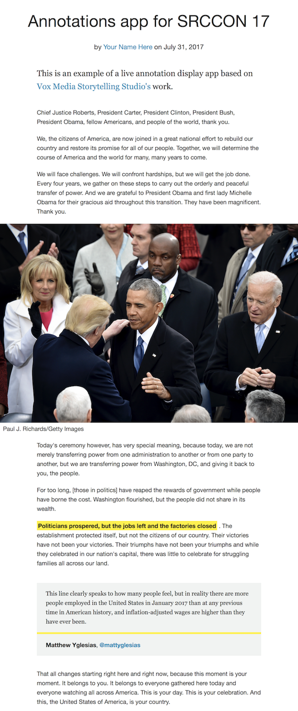

# Making an annotated article





## Steps 

1 Set up API access and credentials for the[ annotated google doc](/what-is-opened-captions/annotations-in-google-doc.md) at [https://console.cloud.google.com](https://console.cloud.google.com)

See this tutorial by David: 

<iframe width="100%" height="315" src="https://www.youtube.com/embed/iH7XtXoiuQk" frameborder="0" allowfullscreen></iframe>

2 clone repo

```bash
git clone https://github.com/kavyasukumar/annotations-app.git
```

3  `cd` into the folder

```
cd ./annotations-app
```

4 bundle install

```
bundle install
```

5 start the static site generator 
```
bundle exec middleman
```

6 view result in `localhost` 
<!-- add actual localhost url -->

7 generated website in in `` folder.


## Resources

- [Annotations app by Kavya](https://github.com/kavyasukumar/annotations-app)

## Documentation 

- [Middleman - static site generator](http://middlemanapp.com)
- [Middleman data folder](https://middlemanapp.com/advanced/data-files/)